# E-Commerce - TP1 Prog II 🚀

## Descripcion del proyecto: 👨‍💻

E-commerce de Zapatillas

Este proyecto consiste en el desarrollo de un e-commerce de zapatillas, enfocado en la experiencia de usuario y la organización visual. El objetivo es crear una interfaz moderna y responsiva utilizando HTML5, CSS3 y JavaScript, mostrando productos, promociones y secciones dinámicas.

## Características Principales: 

* Header con barra de navegación 
Navegación intuitiva hacia las distintas secciones del sitio. 

* Hero principal 
Espacio destacado para promociones y descuentos especiales. 
Métodos de envío 
Descuentos y promociones activas 

* Main con grilla de productos 
Visualización de zapatillas en formato grid, con diseño responsivo. 

* Formulario de contacto 
Para consultas y soporte al cliente. 

* Footer 
Incluye la misma barra de navegación que el header y el Copyright. 

## Tecnologías Utilizadas: 
HTML5 
CSS3 (Flexbox, Grid) 
JavaScript

## Instrucciones de ejecución: 

### Al iniciar la Web nos encotramos con un menú que presenta las siguientes funciones:
#### Dark mode 🌜| Carrito 🛒| Buscar 🔍| Iniciar Sesión 👤| Menú Hamburguesa 🍔
   

* **Carrito**: estructura donde el cliente va guardando los productos seleccionados. El mismo comienza vacío hasta que el cliente comienza a scrollear inspeccionando la pagina y se encuentra con los productos.  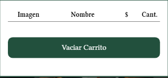 
En cada producto, se presentan dos botones: 
 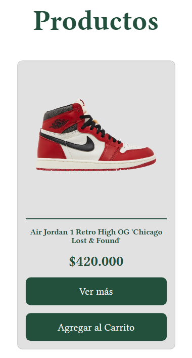 
-- Boton de ***"Ver más"***: el mismo consiste en dirigirnos a una pagina del producto en cuestión con sus respectivos talles disponibles. 
 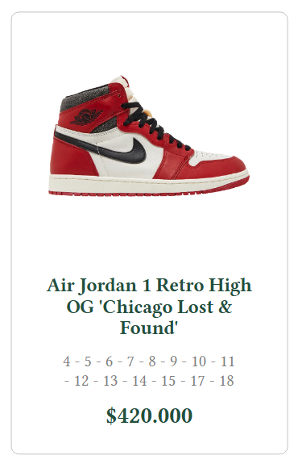 
-- Boton de ***"Agregar al Carrito"***: su función es agregar aquellos productos seleccionados por el cliente para poder realizar la compra. 
 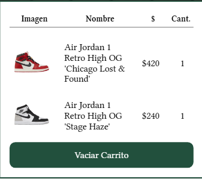 

* **Iniciar Sesión**: allí el cliente completa con sus datos para poder ingresar con su cuenta.  
 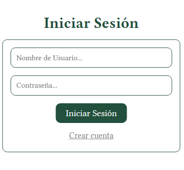 

* **Registrar**: si el cliente es nuevo, podrá registrarse con su datos y poder ser parte de ChispitasSSJ.  
 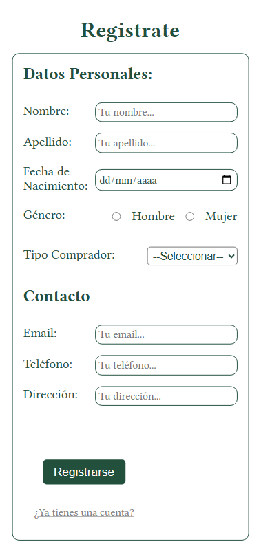 

* **Menu Hamburguesa**: tipo de navegación oculta que se muestra al hacer click.  
 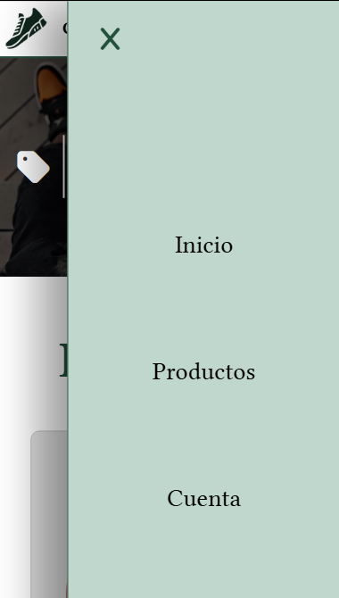 

* **DarkMode**: es una alternativa de estilo visual que cambia la interfaz a una paleta de colores oscuros. 
 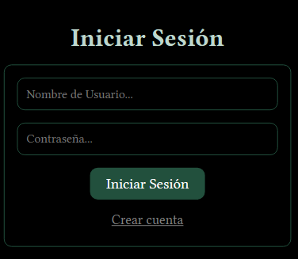  
 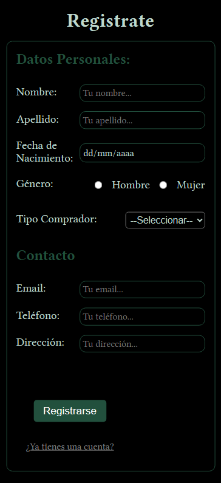  
 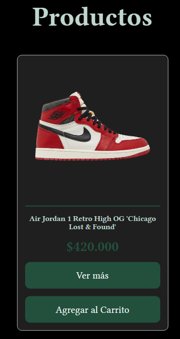  
 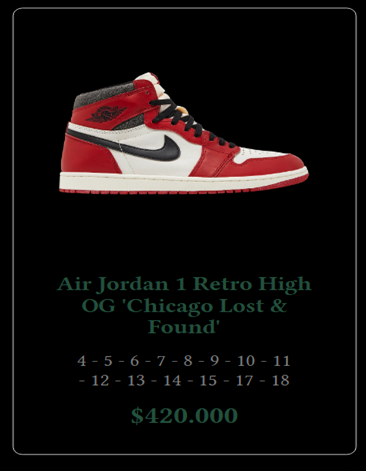  
